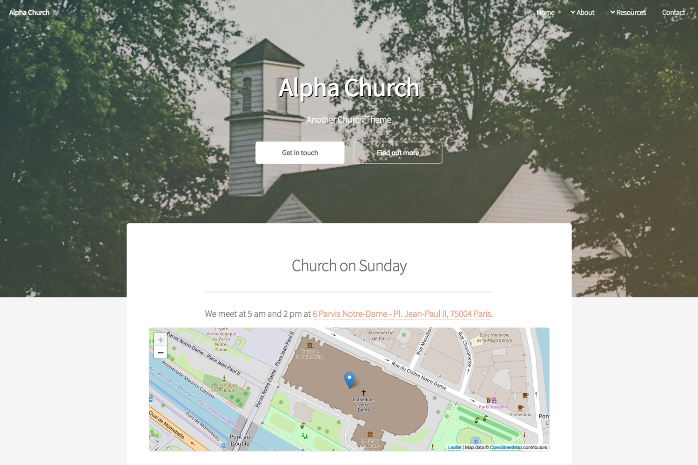

# Alpha-Church by Daniel Saunders

This theme is based on [Alpha by HTML5 UP](http://html5up.net) [@ajlkn](http://twitter.com/ajlkn). Free for personal and commercial use under the CCA 3.0 license (html5up.net/license)

A clean, super minimal responsive template geared towards churches though it could be adapted for other community groups. This theme includes a landing page, open street maps, blog posts and a sermon podcast.



Demo images courtesy of [freelyphotos](https://freelyphotos.com), totally free high quality Christian stock photography available under the amazing [CC0 (public domain)](http://creativecommons.org/publicdomain/zero/1.0/) license.

Feedback, bug reports, and comments are not only welcome, but strongly encouraged :)

## Get the theme

If you have `git` installed, you can do the following at the command-line-interface within the Hugo directory:

```
$ cd themes
$ git submodule add https://github.com/funkydan2/alpha-church.git
```

You should see a folder called `alpha-church` inside the `themes` directory that we created a few moments ago. For more information read the official [setup guide](https://gohugo.io/overview/installing/) of Hugo.

## Setup

In the next step navigate to the `exampleSite` folder at `themes/hugo-travelify-theme/exampleSite/`. Its structure should look similar to this:

To get your site running, copy `config.toml` from the exampleSite folder into the root folder of your Hugo site. (Please refer to http://gohugo.io/overview/quickstart/ for installing a Hugo theme.)

## The `config` file

Now, let us take a look at `config.toml`. Let's take a look at some of the settings.

### 1. Custom CSS
The easiest way to change the look of your site is by overriding the included style sheet. You can do this by putting your own css file in `static/css/my.css` and putting `customCSS = ["my.css"]` in the config file.

### 2. Google Analytics
Enable by putting your Analytics key here.
```
GoogleAnalytics = ""
```

### 3. Menu & Nested Menus

The entries in the items menu can be customised. The structure of the menu is defined in `config.toml`.

```
[menu]
  [[menu.main]]
    name = "Home"
    url = "/"
    weight = 1
```

Define a label and enter the URL of the resource you want to link. The `weight` value determines the order of menu items. Lower weighted entries appear to the *left* of higher weighted entries.

For sub-menus, you can use the following format:

```
[[menu.main]]
  name = "About"
  url = "/about"
  weight = 2

[[menu.main]]
  name = "About Us"
  parent = "About"
  url = "/about"
  weight = 1
```
In this example, *About* is in the main menu, but *About Us* is in the *About* sub-menu. In *Alpha Church* the sub-menu is a drop-down menu.

### 4. Podcasting
In `config.toml` there are  settings which are used to generate the podcast RSS feed.

```
[params.podcast]
  title = "Listen to Alpha Church"
  subtitle = ""
  summary = "Alpha-Church sermons, talks, messages—podcasted."
  email = "test@example.com"
  image = "Link to 1400*1400 (or larger) file"
  category = "Religion & Spirituality"
  sub_category = "Christianity"
```
All of these need to be set (except subtitle) or else the feed will not be valid.

As you're developing your site, you'll need to check the podcast feed is valid by entering the feed's URL into [a podcast feed validator](https://castfeedvalidator.com).

The podcast feed is found at `/sermons/index.xml`.

### 5. Landing (Home) page

#### a. Banner

#### b. Feature Icons

#### c. Feature Images

### 6. Contact Form

### 7. Links


## Nearly finished

To preview your site, run Hugo's built-in local server.

```
$ hugo server
```

Now enter [`localhost:1313`](http://localhost:1313) in the address bar of your browser.

## Credits:

### Demo Images:

- [FreelyPhotos](https://freelyphotos.com):
  - [Banner Image (Church Building)](https://freelyphotos.com/church-building-2/)
  - [Old Bible](https://freelyphotos.com/old-bible-3/)
  - [Running Child](https://freelyphotos.com/running/)
  - [Group of People](https://freelyphotos.com/group-of-people/)
  - [Microphone (podcast cover)](https://freelyphotos.com/microphone/)

### Icons:

* [Font Awesome](http://fortawesome.github.com/Font-Awesome)

### Other:

* [jQuery](http://jquery.com)
* [html5shiv.js](https://github.com/aFarkas/html5shiv) (@afarkas @jdalton @jon_neal @rem)
* [CSS3 Pie](http://css3pie.com)
* [background-size polyfill](http://github.com/louisremi)
* [Respond.js](http://j.mp/respondjs)
* [Skel](http://skel.io)
